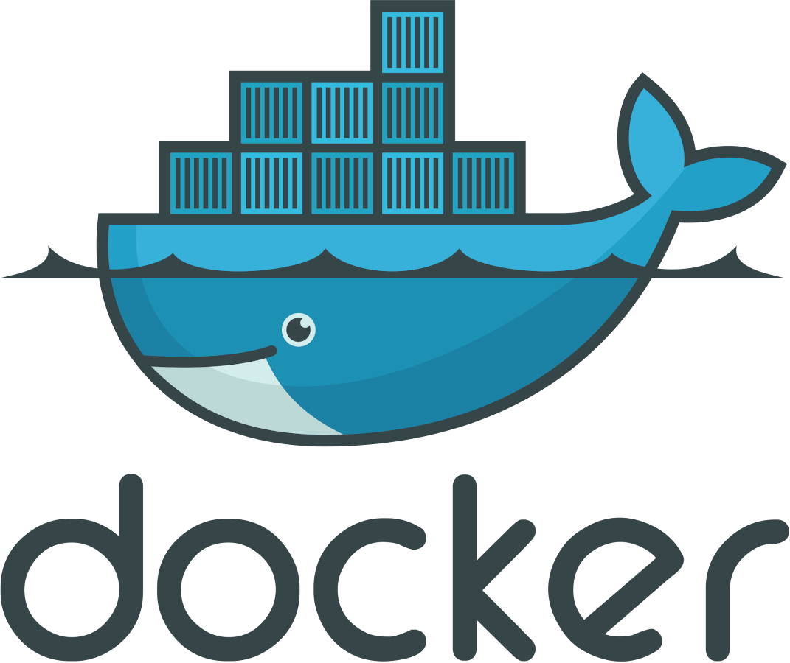
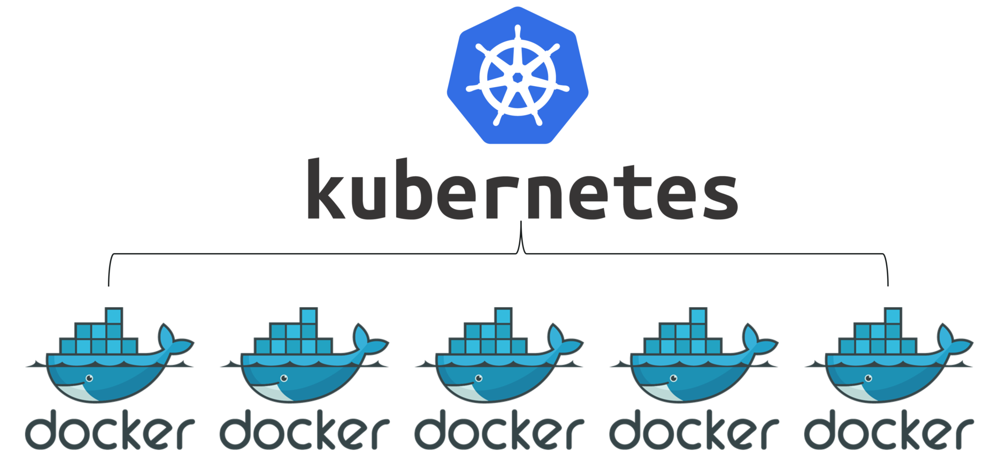

# Microservices with Node JS, React, Docker and Kubernetes
This project aims to set up the mini microservice with **Node JS, React, Docker and Kubernetes**.

## Microservices
Microservice architecture, or simply microservices, is a distintive method of developing software systems that tries to focus on building single-function modiels with well-defined interfaces and operatrions. The trend has grown popular in recent years as Enterprises look to become more Agile and move towards a DevOps and continuous testing.

## Docker

**[Docker](https://www.docker.com/)** is a set of platform as a service (PaaS) products that uses OS-level virtualisation to deliver software in packages called containers. Containers are isolated from one another and bundle their own software, libraries and configuration files; they can communicate with each other through well-defined channels. All containers are run by a single operating system kernel and therefore use fewer resources than virtual machines.

## Kubernetes

**[Kubernetes](https://kubernetes.io)**(K8s) is an open-source container-orchestration system for automating deployment, scaling and management. It was originally designed by Google, and is now maintained by the Cloud Native Computing Foundation. It aims to provide a "platform for automating deployment, scaling and operations of application containers across cluster of hosts. It works with a range of container tools, including Docker. Many cloud services offer a Kubernetes-based platform or infrastructure as a service (PaaS or laaS) on which Kubernetes can be deployed as a platform-providing service. Many vendors also provide their own branded Kuberneted distributions.

Hi! I'm your first Markdown file in **StackEdit**. If you want to learn about StackEdit, you can read me. If you want to play with Markdown, you can edit me. Once you have finished with me, you can create new files by opening the **file explorer** on the left corner of the navigation bar.
