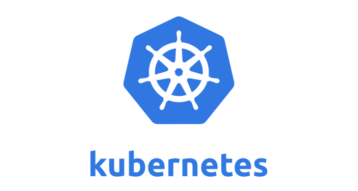
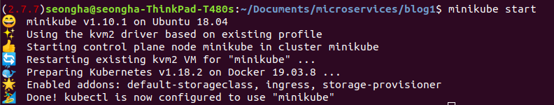

# Microservices with Node JS, React, Docker and Kubernetes
This project aims to set up the mini microservice with **Node JS, React, Docker and Kubernetes**.

## Microservices
Microservice architecture, or simply microservices, is a distintive method of developing software systems that tries to focus on building single-function modiels with well-defined interfaces and operatrions. The trend has grown popular in recent years as Enterprises look to become more Agile and move towards a DevOps and continuous testing.

## Docker
<p align="center">
    
</P>

**[Docker](https://www.docker.com/)** is a set of platform as a service (PaaS) products that uses OS-level virtualisation to deliver software in packages called containers. Containers are isolated from one another and bundle their own software, libraries and configuration files; they can communicate with each other through well-defined channels. All containers are run by a single operating system kernel and therefore use fewer resources than virtual machines.

## Kubernetes
<p align="center">
    
</P>

**[Kubernetes](https://kubernetes.io)**(K8s) is an open-source container-orchestration system for automating deployment, scaling and management. It was originally designed by Google, and is now maintained by the Cloud Native Computing Foundation. It aims to provide a "platform for automating deployment, scaling and operations of application containers across cluster of hosts. It works with a range of container tools, including Docker. Many cloud services offer a Kubernetes-based platform or infrastructure as a service (PaaS or laaS) on which Kubernetes can be deployed as a platform-providing service. Many vendors also provide their own branded Kuberneted distributions.

<!-- GETTING STARTED -->
## Set React
1. Download the project
```sh
git clone https://github.com/sseongha11/microservice-blog.git blog
```
2. move to client folder and check the files

## Set Docker
1. Set **Docker**

```sh
touch Dockerfile
touch .dockerignore
```
2. Set **Dockerfiles (Case1: client folder [React App])**

| Command1 | Command2 | Description |
| --- | --- | --- |
| FROM | node:alpine | Specify base image |
| WORKDIR | /app | Set the working directory to '/app' in the container. All following commands will be issued relative to this dir |
| COPY | package.json ./ | Copy over only the package.json file |
| RUN | npm install | Install all dependencies |
| COPY | ./ ./ | Copy over all of the remaining source codes |
| CMD | ["npm", "start"] | Set the command to run when the container starts up |

```bash
FROM node:alpine

ENV CI=true

WORKDIR /app
COPY package.json ./
RUN npm install
COPY ./ ./

CMD ["npm", "start"]
```

3. Set **Dockerfiles (Case2: comments, event-bus, moderation, posts and query folders)**

```bash
FROM node:alpine

WORKDIR /app
COPY package.json ./
RUN npm install
COPY ./ ./

CMD ["npm", "start"]
```

4. Set **.dockerignore**

```bash
node_modules
```
5. Dockerize

| Command | Description |
| --- | --- |
| docker build -t sseongha11/posts | Build an image based on the dockerfile in the current directory. Tag is as 'sseongha11/posts' |
| docker run **[image id or image tag]** | Create and start a container based on the provided image id or tag |
| docker run -it **[image id or image tag] [cmd]** | Create and start container, but also override the default command |
| docker ps | Print out information about all of the running containers |
| docker exec -it **[Container id] [cmd]** | Execute the given command in a running container |
| docker logs **[container id]** | Print out logs from the given container |

The examples are follows:

```
docker build -t sseongha11/posts
docker run sseongha11/posts
docker run -it sseongha11/posts sh
```

## Set Kubernetes
### Kubernetes Setup (Ubuntu 18.04)
1. Update system
run the following commands to update all system packages to the latest release:
```
sudo apt-get update
sudo apt-get install apt-transport-https
sudo apt-get upgrade
```
2. Install kvm2 drivers
Minikube leverages Docker Machine to manage the Kubernetes VM so that it benefits from the driver plugin architeture of Docker Machine. This requires that the KVM2 driver maintained by minikube team is installed.

```
# make sure official dependencies are already installed
sudo apt install libvirt-clients libvirt-daemon-system qemu-kvm

# install kvm2 driver
curl -LO https://storage.googleapis.com/minikube/releases/latest/docker-machine-driver-kvm2 && sudo install docker-machine-driver-kvm2 /usr/local/bin/
```

3. Download minikube
Download the minikube binary.
```
wget https://storage.googleapis.com/minikube/releases/latest/minikube-linux-amd64
chmod +x minikube-linux-amd64
sudo mv minikube-linux-amd64 /usr/local/bin/minikube
```
confirm version installed
```
$ minikube version
minikube version: v1.10.1
commit: 63ab801ac27e5742ae442ce36dff7877dcccb278
```

4. Install kubectl on Ubuntu
We need kubectl which is a command line tool used to deploy and manage applications on Kubernetes:
```
curl -LO https://storage.googleapis.com/kubernetes-release/release/`curl -s https://storage.googleapis.com/kubernetes-release/release/stable.txt`/bin/linux/amd64/kubectl
```
Make the kubectl binary executable
'''
chmod +x ./kubectl
'''
Move the binary into your PATH
```
sudo mv ./kubectl /usr/local/bin/kubectl
```

5. Start minikube
'''
$ minikube start
'''
<p align="left">
    
</P>